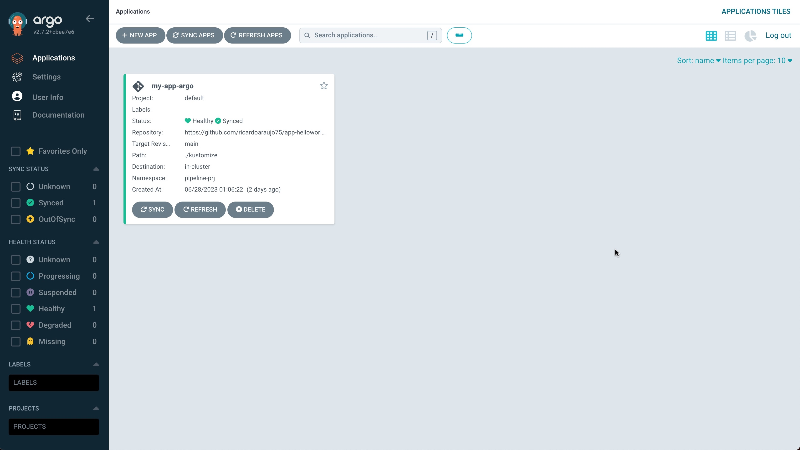

# Tekton - Como automatizar a criação de aplicações no ArgoCD

Normalmente utilizamos o Tekton para a parte do Continuous Integration e o ArgoCD para a parte do Continuous Delivery como nossa solução de CI/CD. Além desse caso também podemos utilizar o ArgoCD para diversos outros casos de uso.

Para esse contexto, estamos trazendo um exemplo de como criar uma aplicação no ArgoCD de uma forma automatizada através de um pipeline e uma task do Tekton.

Para tal, vamos precisar de:
- Cluster Openshift 4.12+ Instalado
- Operator do Openshift Pipeline (Tekton)
- Operator do Openshift GitOps (ArgoCD)
- Um repositório para controle dos arquivos (github)

A solução foi construida a partir dos objetos pipeline e task.

Nomeamos a task com create-app-argocd, passando como parâmetro a URL do ArgoCD, usuário e senha para acesso, nome da aplicação que será criada no ArgoCD, o repositório de configuração, a namespace e o ambiente. Ressaltamos que deixamos a URL, usuário e senha fixos na task pois será sempre os mesmos valores e os demais dados são variáveis e serão enviados pelo pipeline.
Utilizamos uma imagem do ArgoCD e tem o cli do argo, utilitário necessário para acesso e criação da aplicação no ArgoCD.

Para a tarefa são utilizados dois comandos:
1. login de acesso, onde precisamos da URL, usuário e senha.
2. criação da aplicação, onde passamos o nome da aplicação, o repositório, ambiente e namespace.

As informações dos parâmetros utilizados no comando estão no link https://argo-cd.readthedocs.io/en/stable/user-guide/commands/argocd_app_create.

No pipeline definimos a task criada e passamos os parâmetos que podem ser criados dinamicamente ou ficar em outros objetos como por exemplo um triggerTemplate.

Pronto é só executar e testar, agora você pode automatizar suas aplicações do ArgoCD a partir de seu pipeline do Tekton.

Pipeline
||
|-|

Application created in the ArgoCD.
||
|-|

Application Running in the ArgoCD.
||
|-|